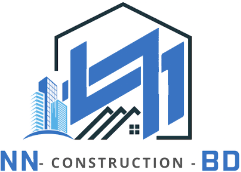
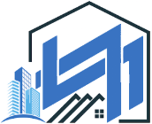

<div align="center">



<br />
<br />

_Your dream, our hardwork._

<br />

[](https://github.com/Bamyani1/nn-construction-)

<br />


</div>

<br />

---

## Overview

Marketing site for **NN Construction** &mdash; full-service residential construction in the DC metro, with roofing as a proven specialty. A cyanotype blueprint palette, nine hand-composed routes, and a construction-company voice &mdash; not an architect's. Every page prerenders statically.

<br />

## Tech Stack

| Layer         | Tools                                                                           |
| ------------- | ------------------------------------------------------------------------------- |
| **Framework** | Next.js 15.5 (App Router, React Server Components), React 19, TypeScript 5.7    |
| **Styling**   | CSS custom properties in `app/globals.css` &mdash; no Tailwind, no CSS-in-JS    |
| **Fonts**     | Space Grotesk + JetBrains Mono via `next/font` (400 and 500 weights only)       |
| **Media**     | `next/image` with AVIF/WebP negotiation, Sharp + `sips` HEIC pipeline           |
| **Motion**    | Lenis smooth scroll                                                             |
| **Hosting**   | Static prerender, Vercel-ready                                                  |

<br />

## Getting Started

### Prerequisites

- **Node.js 20 LTS** or newer
- **npm 10** or newer

### Local development

```bash
git clone https://github.com/Bamyani1/nn-construction-.git
cd nn-construction-
npm install
npm run dev              # http://localhost:3000
```

### Scripts

| Command           | Description                                                    |
| ----------------- | -------------------------------------------------------------- |
| `npm run dev`     | Start the Next.js dev server (Turbopack) on port 3000          |
| `npm run build`   | Production build                                               |
| `npm run start`   | Serve the production build                                     |
| `npm run lint`    | ESLint via `eslint-config-next`                                |
| `npm run images`  | Regenerate `/public/assets/projects/**` from `/NN-pictures/**` |

<br />

## Highlights

- **Cyanotype blueprint design system** &mdash; every color, type step, spacing unit, and radius lives as a CSS custom property in a single `:root` block. No utility framework, no runtime styling.
- **Nine editorial routes** &mdash; home, about, interior services, exterior services, portfolio, testimonials, FAQ, contact, and a design canvas that scales every page into one view.
- **Static by construction** &mdash; every route prerenders as `○ (Static)`. No servers to run, no caches to warm.
- **Filterable portfolio with gallery modal** &mdash; category tabs across All / Roofing / Interior / Exterior, per-project hero, and a keyboard-navigable image lightbox.
- **Real project photography** &mdash; HEIC sources from an iPhone pass through a repeatable `npm run images` pipeline. Each slug folder is rebuilt atomically, so a mid-run failure never leaves production pointing at an empty folder.
- **Typed content model** &mdash; projects, testimonials, crew, stats, and FAQs all live in `lib/data.ts`. Swapping a photo or adding a quote is a one-file change with full type safety.
- **Performance-tuned images** &mdash; `next/image` handles AVIF/WebP negotiation, responsive `srcset`, and lazy loading. Source images cap at 1600px at WebP q80.

<br />

## Pages

| Page         | Route                 | Description                                                                              |
| ------------ | --------------------- | ---------------------------------------------------------------------------------------- |
| Home         | `/`                   | Hero split &middot; four pillars &middot; stats &middot; services, portfolio, and testimonial previews |
| About        | `/about`              | Principles, founder's note, crew, licensure                                              |
| Interior     | `/services/interior`  | Interior disciplines and the project process                                             |
| Exterior     | `/services/exterior`  | Exterior disciplines and roofing specialty spec sheet                                    |
| Portfolio    | `/portfolio`          | Filterable project grid with hero view and gallery modal                                 |
| Testimonials | `/testimonials`       | Attributed client quotes                                                                 |
| FAQ          | `/faq`                | Accordion                                                                                |
| Contact      | `/contact`            | Estimate form (front-end only &mdash; see [Roadmap](#roadmap))                           |
| Canvas       | `/canvas`             | Design canvas &mdash; every page scaled into one view (noindex)                          |

Plus `/sitemap.xml`, `/robots.txt`, `/opengraph-image.jpg`, and `/icon.svg`.

<br />

## Design System

The _cyanotype blueprint_ palette and every visual value are declared as CSS custom properties inside `app/globals.css`:

| Category       | Examples                                                                                      |
| -------------- | --------------------------------------------------------------------------------------------- |
| **Colors**     | `#ECF1F7` paper, `#0B1A2E` ink, `#3973C2` azure, `#64748B` slate, `#B6C7E8` periwinkle accent |
| **Typography** | Space Grotesk for display and body, JetBrains Mono for numerics and micro copy                |
| **Layout**     | 1240px content max, 96px gutter, 160px section gap                                            |
| **Radii**      | Mostly sharp &mdash; 2px on inputs, 4px on cards, pill only on tags                           |

<br />

## Image Pipeline

`npm run images` rebuilds `/public/assets/projects/<slug>/` from iPhone HEICs in `/NN-pictures/`. Each source passes through `sips` (HEIC → q95 JPEG) and then Sharp (EXIF rotate → resize to 1600px max edge → WebP q80). The folder-to-slug map and hero-first file ordering are hard-coded in `scripts/compress-images.mjs`; raw HEICs stay gitignored and local-only.

<br />

## Roadmap

- **Contact form backend** &mdash; wire `components/contact-form.tsx` to Resend via a route handler. Current submit flips local state only.
- **Mobile navigation drawer** &mdash; replace the stacking link strip on viewports ≤ 640px with a proper hamburger drawer.
- **Per-page OpenGraph imagery** &mdash; every route currently inherits the root `openGraph`; `/portfolio` especially deserves its own card.

<br />

---

<div align="center">



<br />
<br />

[**github.com/Bamyani1/nn-construction- &rarr;**](https://github.com/Bamyani1/nn-construction-)

&copy; 2026 NN Construction

</div>
